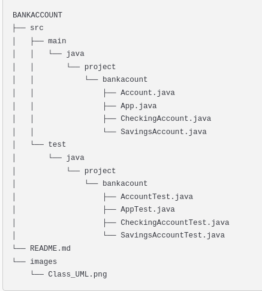
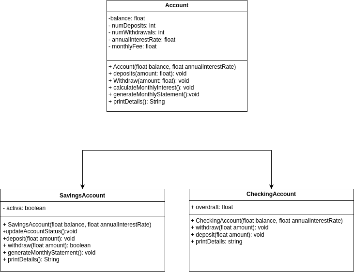

# BankAccount Project

## Descripción

El proyecto **BankAccount** es una aplicación de gestión bancaria desarrollada en Java. Esta solución permite a los usuarios manejar diferentes tipos de cuentas bancarias, como cuentas de ahorro (**SavingsAccount**) y cuentas corrientes (**CheckingAccount**). El sistema incluye funciones como depósitos, retiros, cálculo de intereses, manejo de sobregiros y generación de estados de cuenta mensuales.

El código está diseñado con un enfoque modular, orientado a objetos, y ha sido rigurosamente probado utilizando pruebas unitarias con JUnit 5.

---

## Características

- **Cuenta de Ahorros (SavingsAccount):**
  - Consignar una cantidad de dinero en la cuenta actualizando su saldo.
  - Retirar una cantidad de dinero en la cuenta actualizando su saldo. 
  - Calcular el interés mensual de la cuenta y actualiza el saldo correspondiente.
  - Extracto mensual
  - Impresión de detalles de la cuenta.

- **Cuenta Corriente (CheckingAccount):**
  - Retirar: se retira dinero de la cuenta actualizando su saldo. Se puede retirar dinero superior al saldo. El dinero que se debe queda como sobregiro.
  - Consignar: invoca al método heredado. Si hay sobregiro, la cantidad consignada reduce el sobregiro.
  - Extracto mensual: invoca al método heredado.
  - Un nuevo método imprimir que retorna el saldo de la cuenta, la comisión mensual, el número de transacciones realizadas (suma de cantidad de consignaciones y retiros) y el valor de sobregiro.

- **Pruebas Unitarias:**
  - Cobertura completa de métodos clave en ambas clases.
  - Validación del comportamiento bajo diferentes escenarios.

## Estructura del Proyecto

## Diagrama UML

A continuación, se incluye el diagrama UML que ilustra las relaciones entre las clases principales del proyecto. Puedes visualizar el diagrama en la siguiente imagen:

## Autor

Yuliana Alcalá